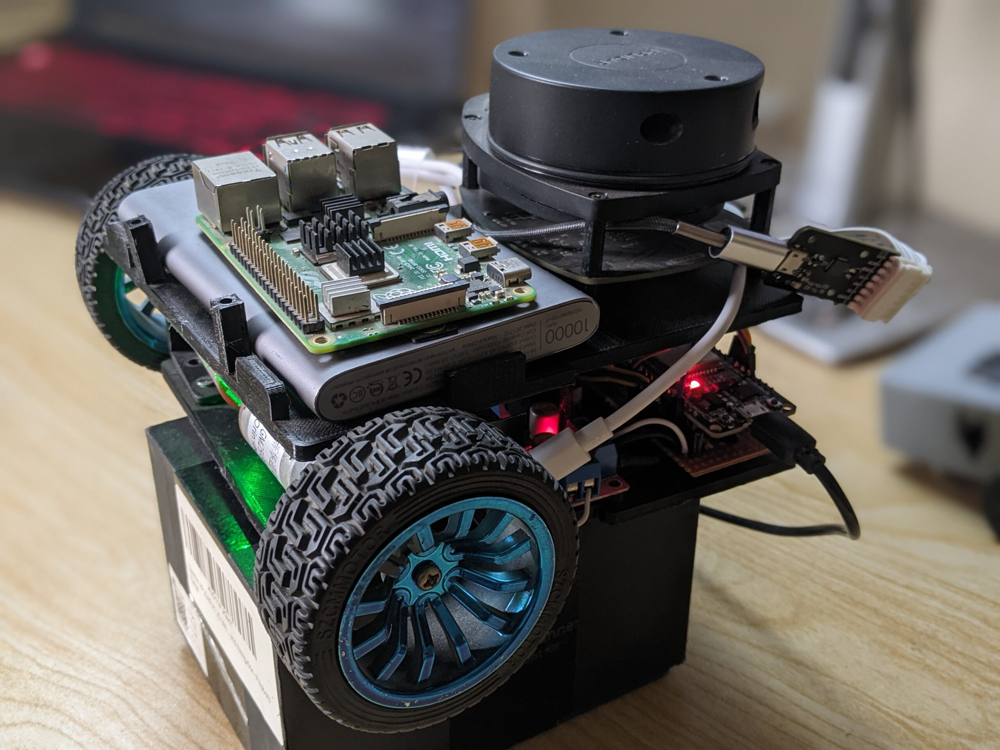

# Mobile Robotics Software Engineer
Complete software based curriculum is designed to take you through the foundational and advanced concepts of robotics software engineering using ROS2, C++, and other critical technologies in the field. Below, you'll find a structured path to guide your learning journey. Each module contains a brief overview of its learning outcomes to help you understand what skills and knowledge you'll gain upon completion.

	

### Information
- Go through Curriculum -> [here](https://robotisim.com/learning-paths/)
- **Source Code will be open source**
    - If you are interested in learning with
        - Detailed explanation from simulation to real hardware
        - Assignments

### Contact Us
For any inquiries, feel free to reach out at `info@robotisim.com`

### Packages
- **Packages** (in recommended learning order both in simulation and real hardware )
	- Creation of a mobile Robot
	- Robot decision making with sensors
	- Control Systems for goal driving
	- SLAM with 2d Lidar
	- Path planning
	- Navigation

## License
This work is licensed under a Creative Commons Attribution-NonCommercial 4.0 International License. This license allows others to remix, tweak, and build upon the work non-commercially, as long as they credit the owner (robotisim) and license their new creations under the identical terms.

For more information, please visit [Creative Commons License](http://creativecommons.org/licenses/by-nc/4.0/).

---

 2024 robotisim. All rights reserved.
